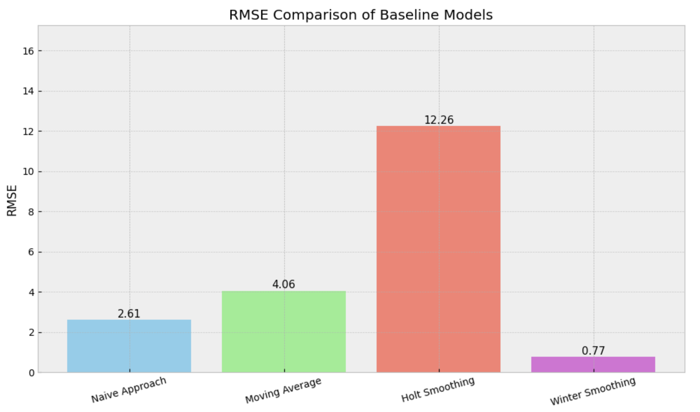
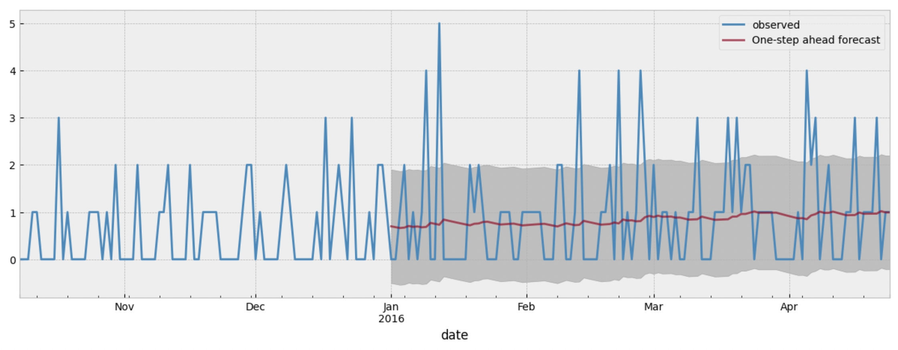
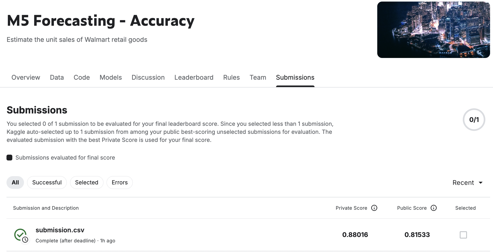

# 🛒 Walmart Sales Forecasting – M5 Forecasting Accuracy

**Project Title:** Sales Forecasting for Walmart Retail Products  
**Competition:** [M5 Forecasting - Accuracy | Kaggle](https://www.kaggle.com/competitions/m5-forecasting-accuracy)  
**Score Achieved:** 0.88016 (Weighted RMSSE)

---

## 📌 Overview

Forecasting future sales is a critical component in supply chain management, inventory control, and retail analytics. This project was developed as part of the M5 Forecasting - Accuracy competition on Kaggle, where the goal was to predict daily unit sales of thousands of Walmart products across multiple U.S. states over a 28-day horizon.

Accurate forecasting minimizes costs, reduces waste, and helps make informed business decisions. In this project, I explore multiple forecasting techniques, from classical time-series models to deep learning methods like LSTM.

---

## 🎯 Project Goal

The main objective of this project is to:

> **Predict daily unit sales for Walmart items across multiple stores and categories using a variety of forecasting methods.**

By applying statistical models, machine learning, and deep learning techniques, I aimed to:
- Understand the underlying structure of the sales data
- Identify and remove trends/seasonality
- Build and evaluate accurate forecasting models
- Submit predictions and achieve a competitive score

---

## 📦 Dataset Description

The dataset provided by Kaggle includes hierarchical sales data at the item and store level, covering:

- **Stores**: 3 states (CA, TX, WI)
- **Product Categories**: 3
- **Stores**: 10
- **Departments**: 7
- **Items**: 3049 individual products
- **Time Frame**: Daily sales over several years
- **Features**:
  - Unit sales per product per day
  - Calendar data (holidays, events, weekdays)
  - Sell prices over time
  - Hierarchical metadata (category, department, store)

---

## 📁 Notebooks Breakdown

### 📓 Notebook 1: `01_EDA_Baseline_Models.ipynb`

This notebook covers:
- Exploratory Data Analysis (EDA) to understand trends, distribution, missing values
- Baseline forecasting models for benchmarking:
  1. **Naive Forecast** – Tomorrow's sales = Today's sales
  2. **Moving Average** – Forecast based on trailing average (e.g., past 30 days)
  3. **Hot Linear Model** – Exponential smoothing with trend (no seasonality)
  4. **Holt-Winter Smoothing** – Exponential smoothing considering both trend and seasonality
 
#### 📊 Baseline RMSE Comparison

The RMSE values from the baseline models show Holt Smoothing performing the worst, while Winter Smoothing (Holt-Winters) performs best among the basic methods.

---

### 📓 Notebook 2: `02_TimeSeries_Decomposition_ARIMA.ipynb`

This notebook focuses on time-series decomposition and ARIMA modeling:
- 📉 **Stationarity Checks**:
  - Rolling mean and variance
  - Augmented Dickey-Fuller (ADF) Test
- 🔧 **Making Series Stationary**:
  - De-trending and de-seasonalizing
- 🔍 **Autocorrelation Analysis**:
  - ACF and PACF plots
- 📈 **ARIMA Modeling**:
  - Hyperparameter tuning using grid search
  - Model fitting on stationary series
 
We evaluate ARIMA predictions over the final 200 days:

- 📉 **Mean Squared Error:** `1.1428`
- As evident from the graph, ARIMA struggled to capture the sharp variations in the sales data, particularly in high volatility periods.

---

### 📓 Notebook 3: `03_LSTM_Model.ipynb`

Here, I apply a **Long Short-Term Memory (LSTM)** neural network for multistep time-series prediction:
- Data preparation and windowing for LSTM
- Model architecture and training
- Forecasting future sales using LSTM output
- Submission generation and score verification

#### 📈 Kaggle Submission Score

The final submission using LSTM yielded:

- ✅ **Private Score:** `0.88016`
- ✅ **Public Score:** `0.81533`

---

## 📊 Evaluation Metric

The competition used **Weighted Root Mean Squared Scaled Error (RMSSE)**.  
This metric is well-suited for hierarchical time-series forecasting, as it accounts for both scale and error consistency across different aggregation levels.

---

## 🚀 Future Improvements

- Incorporate lag features and external (exogenous) variables to enhance model performance
- Use Prophet, TBATS or other ensemble models
- Probabilistic forecasting (quantiles, intervals)
- Category-specific modeling and feature engineering
- Reduce memory usage and optimize performance for large-scale deployment

---

## 📎 Acknowledgements

This project is based on the [M5 Forecasting - Accuracy](https://www.kaggle.com/competitions/m5-forecasting-accuracy/overview) competition by Kaggle, Walmart, and the Makridakis Open Forecasting Center (MOFC), supported by NTUA, INSEAD, Google, Uber, and IIF.

---

## 💼 Author

Aditya Kariwal
[GitHub](https://github.com/adityakariwal) • [LinkedIn](https://www.linkedin.com/in/aditya-kariwal-730a04295/)  

---
